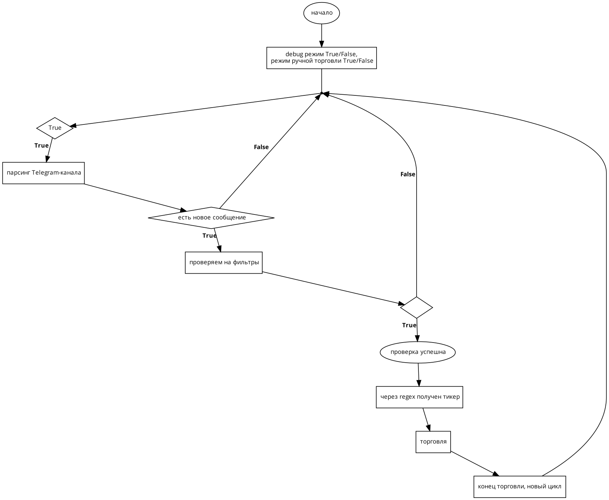
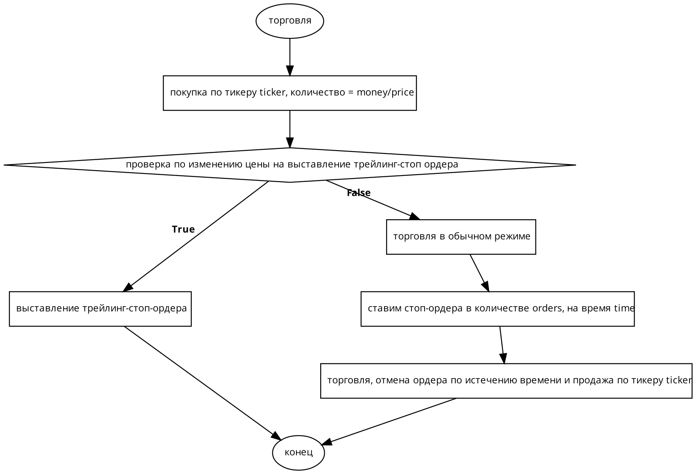
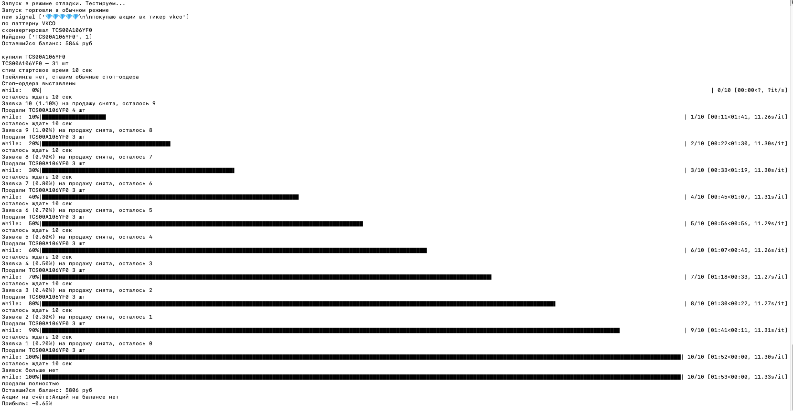

Проект по парсингу телеграм-канала и торговле на бирже

В conditions задаются все нужные параметры

Для торговли на бирже используется Tinkoff (Т-банк) и его API
Для парсинга используется telethon
В ранних версиях проекта для расшифровки сообщения из тг-канала использовался GPT от OpenAI, после v19 он отключён, распознавание сигнала проходит через regex

Обновление базы данных акций, доступных для торговли выполняется ежедневно

Разворачивается через Docker

`docker build -t invest .;docker run -it --name inv -e DEBUG=False -e MANUAL=FALSE invest
`

Пример работы (был выбран рандомный сигнал, чтобы показать работоспособность)

